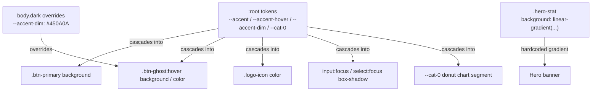

# Design Document: Red/Rose Theme Color Change

## Overview

This change replaces every blue/purple accent value in `css/style.css` with a bold crimson/rose palette. Only five targeted lines in one file are touched — no HTML or JavaScript is modified.

---

## Architecture

The entire theming system is token-based: CSS custom properties defined in `:root` and `body.dark` cascade through every component. Changing the token definitions at the top of the file is sufficient to repaint all interactive elements globally.



---

## Exact CSS Changes Required

Only `css/style.css` is modified. The following table maps each changed line to the requirement that drives it.

| Location in file | Old value | New value | Requirement |
|---|---|---|---|
| `:root` → `--accent` | `#2563EB` | `#DC2626` | 1.1, 1.4 |
| `:root` → `--accent-hover` | `#1D4ED8` | `#B91C1C` | 1.2, 1.5 |
| `:root` → `--accent-dim` | `#EEF3FD` | `#FEF2F2` | 1.3 |
| `:root` → `--cat-0` | `#2563EB` | `#DC2626` | 5.1, 5.2 |
| `body.dark` → `--accent-dim` | `#1E2D5A` | `#450A0A` | 2.1 |
| `.hero-stat` → `background` | `linear-gradient(135deg, #2563EB 0%, #7C3AED 100%)` | `linear-gradient(135deg, #DC2626 0%, #9F1239 100%)` | 3.1, 3.2 |
| `input:focus, select:focus` → `box-shadow` | `0 0 0 3px rgba(37,99,235,.12)` | `0 0 0 3px rgba(220,38,38,.15)` | 4.1, 4.2 |

---

## Before / After Diff

### `:root` block

```css
/* BEFORE */
--accent:      #2563EB;
--accent-dim:  #EEF3FD;
--accent-hover:#1D4ED8;
/* ... */
--cat-0: #2563EB;

/* AFTER */
--accent:      #DC2626;
--accent-dim:  #FEF2F2;
--accent-hover:#B91C1C;
/* ... */
--cat-0: #DC2626;
```

### `body.dark` block

```css
/* BEFORE */
--accent-dim:  #1E2D5A;

/* AFTER */
--accent-dim:  #450A0A;
```

### `.hero-stat` rule

```css
/* BEFORE */
background: linear-gradient(135deg, #2563EB 0%, #7C3AED 100%);

/* AFTER */
background: linear-gradient(135deg, #DC2626 0%, #9F1239 100%);
```

### `input:focus, select:focus` rule

```css
/* BEFORE */
box-shadow: 0 0 0 3px rgba(37,99,235,.12);

/* AFTER */
box-shadow: 0 0 0 3px rgba(220,38,38,.15);
```

---

## Tokens Left Unchanged

The following tokens are explicitly out of scope and MUST remain at their current values:

| Token | Current value |
|---|---|
| `--bg` | `#F0F2F7` |
| `--surface` | `#FFFFFF` |
| `--surface2` | `#F7F8FB` |
| `--border` | `#E4E7EF` |
| `--text` | `#1A1D2E` |
| `--muted` | `#7B82A0` |
| `--danger` | `#EF4444` |
| `--danger-dim` | `#FEF2F2` |
| `--success` | `#10B981` |
| `--radius` | `12px` |
| `--radius-sm` | `8px` |
| `--font` | `'Inter', system-ui, sans-serif` |
| `--cat-1` … `--cat-7` | `#8B5CF6`, `#10B981`, `#F59E0B`, `#EF4444`, `#EC4899`, `#06B6D4`, `#84CC16` |

---

## Components and Interfaces

This feature is a pure CSS token substitution. There are no software components, classes, or interfaces involved. The only "component" is the CSS custom property system built into the browser.

| "Component" | Role |
|---|---|
| `:root` token block | Defines all accent tokens for light mode |
| `body.dark` token block | Overrides `--accent-dim` for dark mode |
| `.hero-stat` rule | Applies the hardcoded gradient background |
| `input:focus, select:focus` rule | Applies the focus ring box-shadow |

---

## Data Models

There are no data models for this feature. All state is expressed as static CSS values; no runtime data structures, APIs, or persistence are involved.

---

## Error Handling

Because all changes are pure CSS token reassignment and value substitution, no error handling logic is required. If a browser fails to parse a custom property, CSS cascade ensures the element renders with its inherited or initial value — no JavaScript or layout is affected (Requirement 6, AC 1.6).

---

## Testing Strategy

### Unit / Example Tests

All verifiable acceptance criteria are testable by inspecting the final `css/style.css` file:

1. Grep for old blue literals (`#2563EB`, `#1D4ED8`, `#7C3AED`, `rgba(37,99,235`) — none should appear inside accent, gradient, or focus rules.
2. Grep for new values (`#DC2626`, `#B91C1C`, `#FEF2F2`, `#450A0A`, `#9F1239`, `rgba(220,38,38`) — all should appear exactly where expected.
3. Confirm unchanged tokens by reading their values and comparing to the table above.
4. Visually verify in a browser: light mode and dark mode both show crimson accents with no blue remnants.

Property-based testing is not applicable here because the change is a fixed declarative substitution with no input variability — example-based verification is the correct strategy.

---

## Correctness Properties

*A property is a characteristic or behavior that should hold true across all valid executions of a system — essentially, a formal statement about what the system should do.*

### Property 1: No old blue accent literals remain

*For any* accent-related CSS rule (`--accent`, `--accent-hover`, `.hero-stat background`, `input:focus box-shadow`), the final `css/style.css` file SHALL NOT contain any of the old blue color literals: `#2563EB`, `#1D4ED8`, `#7C3AED`, or `rgba(37,99,235`.

**Validates: Requirements 1.4, 1.5, 2.3, 3.2, 6.4**

### Property 2: All new red token values are present and correct

*For any* accent token defined in `:root` or `body.dark`, the value in the final CSS file SHALL exactly match the specified crimson/rose palette: `--accent: #DC2626`, `--accent-hover: #B91C1C`, `--accent-dim: #FEF2F2` (light), `--accent-dim: #450A0A` (dark), `--cat-0: #DC2626`.

**Validates: Requirements 1.1, 1.2, 1.3, 2.1, 5.1**

### Property 3: Unchanged tokens are unmodified

*For any* token listed in the "Tokens Left Unchanged" table, the value in the final CSS file SHALL be bit-for-bit identical to the value in the original file.

**Validates: Requirements 6.1, 5.3**

### Property 4: Scope is limited to css/style.css

*For any* file in the project other than `css/style.css`, the content SHALL be identical before and after the change — no HTML structure, JavaScript logic, or other files are modified.

**Validates: Requirements 6.2, 6.3**
